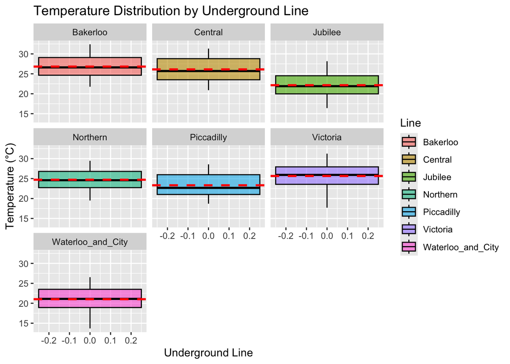
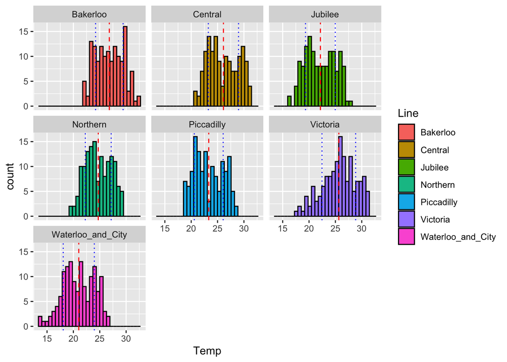
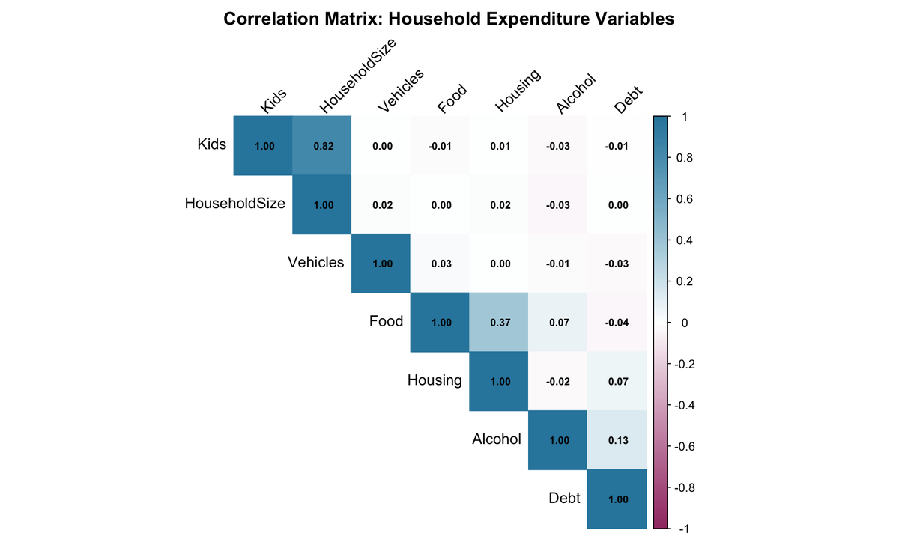
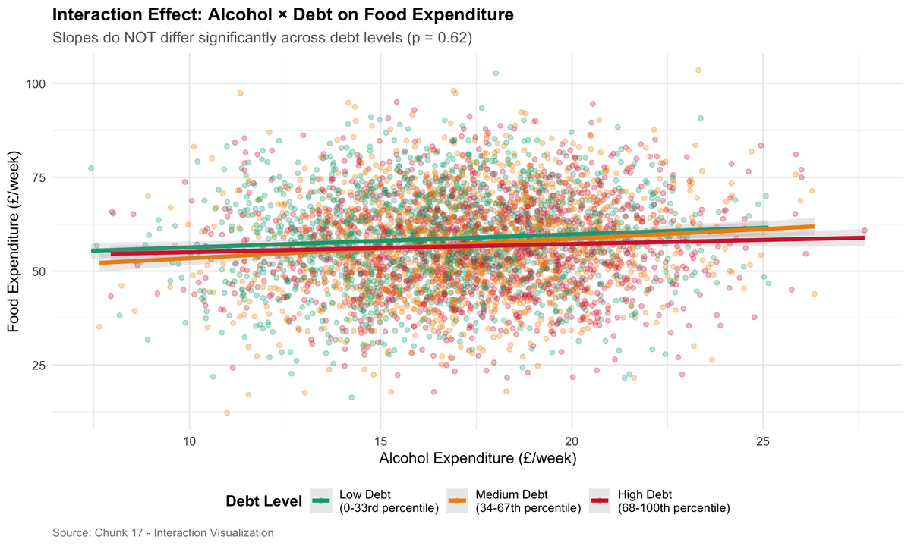
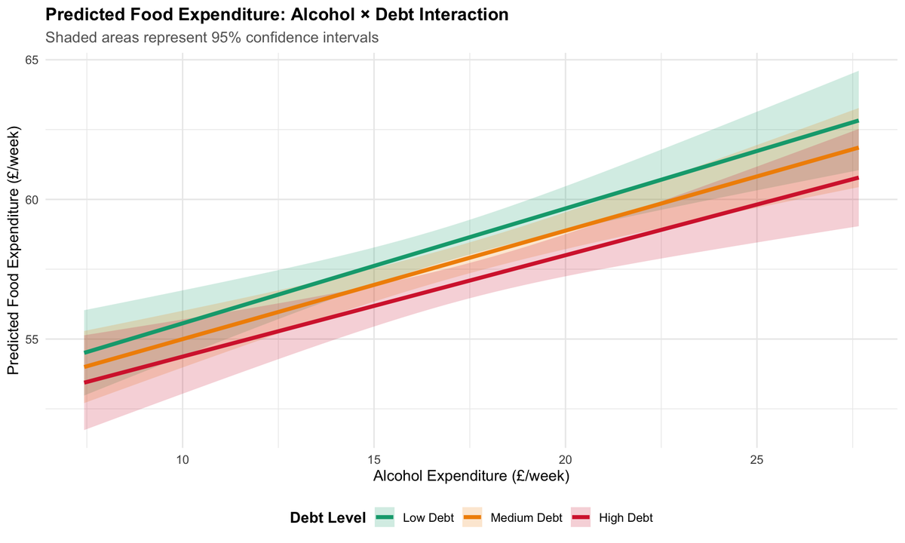
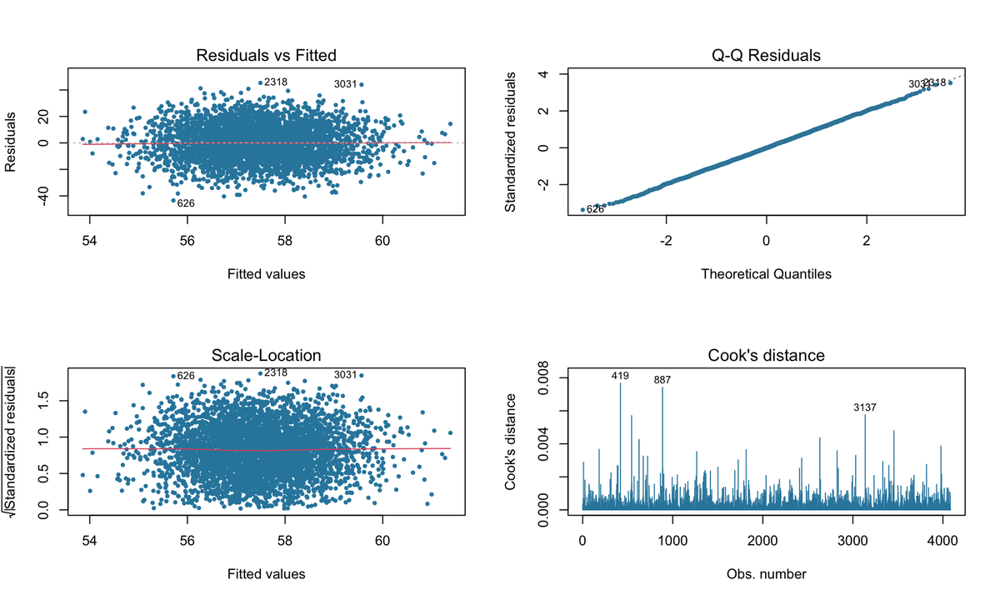
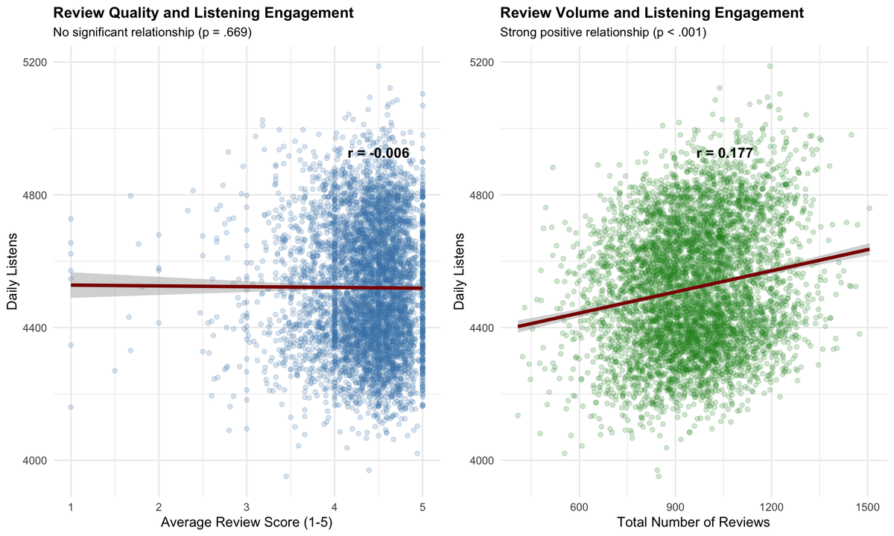
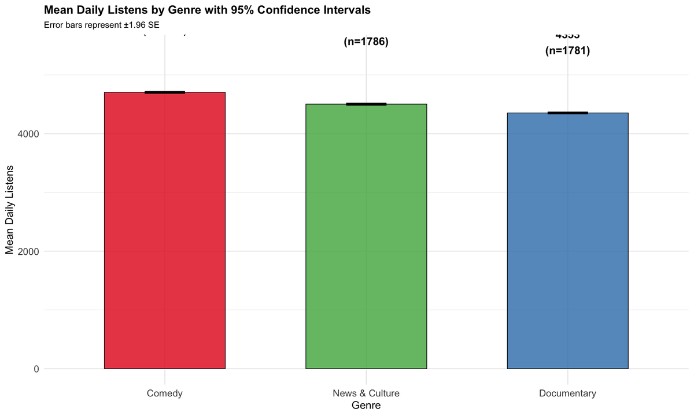
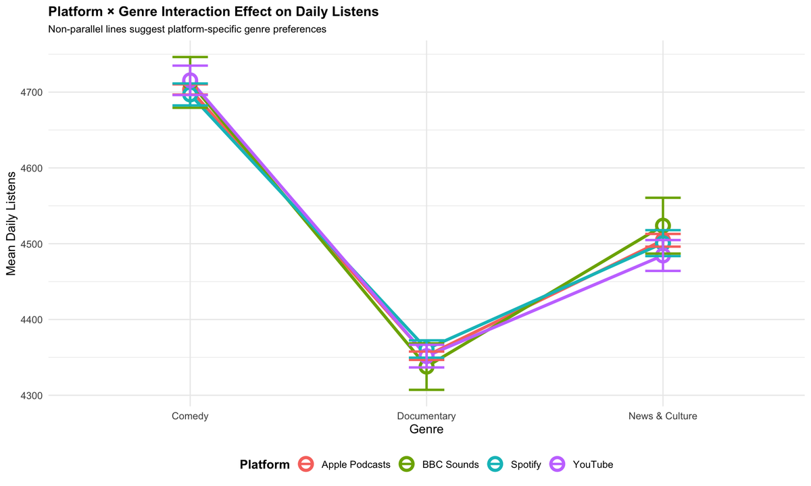
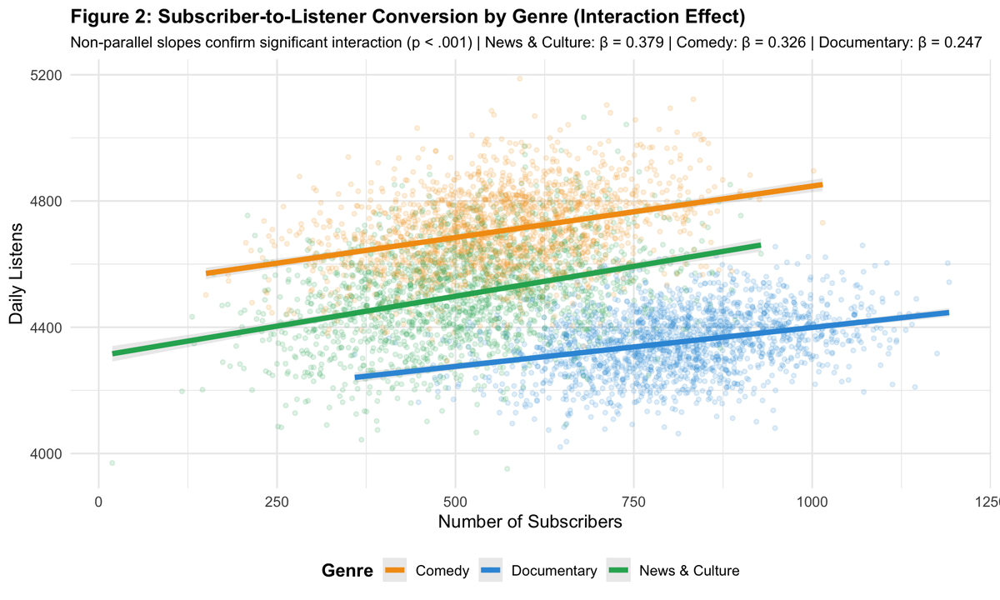

# Applied Statistical Modelling in R

[](https://www.r-project.org/)
[](https://rmarkdown.rstudio.com/)
[](https://www.tidyverse.org/)
[](LICENSE)

Three end-to-end statistical case studies in R — hypothesis testing, multiple regression with interaction effects, and analysis of variance — each framed around a decision a business or policy stakeholder actually has to make.

---

## Overview

This repository contains three independent analyses completed for **IB94X0 Business Statistics** on the MSc Business Analytics & Artificial Intelligence programme at Warwick Business School. Each is a self-contained, fully reproducible R Markdown document that moves from raw data through cleaning, diagnostics and inference to a concrete recommendation.

The common thread is **inferential discipline**: every claim is tied to a test statistic, an effect size and a confidence interval, and results that fail to reach significance are reported as such rather than reframed.

| # | Analysis | Core method | Data | Decision supported |
|---|----------|-------------|------|--------------------|
| 1 | [London Underground Temperature](analysis/01_underground_temperature_analysis.Rmd) | Welch two-sample *t*-tests | 1,153 obs, 2013–2024 | Where to install air-cooling infrastructure |
| 2 | [Household Food Expenditure](analysis/02_household_food_expenditure.Rmd) | Multiple regression + interaction | 4,097 households | Which levers actually move food spending |
| 3 | [Podcast Listening Patterns](analysis/03_podcast_listening_patterns.Rmd) | ANOVA, Tukey HSD, moderation | 5,400 podcasts | Where to allocate content and marketing spend |

---

## 1. London Underground Temperature Analysis

### Business problem

Transport for London must decide where to deploy a limited air-cooling budget across the Underground network. Installing on the wrong line wastes capital and leaves passengers exposed to genuine thermal risk.

### Objectives

- Identify which lines operate at temperatures exceeding passenger comfort thresholds
- Test whether the two hottest lines differ from one another to a statistically meaningful degree
- Determine whether any such difference persists during summer, when risk is greatest
- Convert the findings into a phased investment recommendation

### Dataset

| Variable | Description |
|----------|-------------|
| `ID` | Unique observation identifier |
| `Year` | Year of measurement (2013–2024) |
| `Month` | Month of measurement |
| `Line` | Underground line name |
| `Temp` | Temperature in °C |

1,153 raw observations. Sub-surface lines were excluded — they are naturally ventilated and not comparable to deep-tube lines. After removing missing `Temp` values and outliers, **1,134 observations** entered the analysis.

### Methodology

1. **Integrity checks** — dimensions, structure, missingness audit
2. **Cleaning** — removal of missing temperature records, visual outlier identification via boxplot
3. **Scope restriction** — sub-surface lines excluded to ensure a like-for-like comparison
4. **Exploration** — per-line distributions with mean and standard deviation overlays
5. **Inference** — Welch two-sample *t*-tests, run on the full year and again restricted to summer (May–August)

### Results

<p align="center">
  
</p>

**Descriptive findings**

| Line | Mean temp | vs. coolest line |
|------|-----------|------------------|
| Bakerloo | 27.8 °C | **+69%** |
| Central | 27.2 °C | **+66%** |
| Waterloo & City | 16.4 °C | baseline |

An **11.4 °C spread** separates the hottest and coolest lines.

**Hypothesis tests**

| Test | *t* | *p* | Conclusion |
|------|-----|-----|------------|
| Bakerloo vs Central, full year | 2.177 | **0.0303** | Significant — Bakerloo (26.8 °C) runs hotter than Central (26.1 °C) |
| Bakerloo vs Central, summer only | 0.158 | 0.8748 | Not significant — both at 28.7 °C |

The second test is the more consequential one. The full-year difference is statistically significant but small; in summer — the period that actually determines passenger risk — **the two lines are indistinguishable, and both exceed 28 °C**. A recommendation resting on the annual average alone would understate the case for treating Central.

<p align="center">
  
</p>

### Recommendation

Prioritise **Bakerloo** in phase one on the strength of the highest mean temperature, the greatest variance, and a statistically significant full-year difference. Follow with **Central** in phase two — the summer result shows it carries equivalent peak risk, and sequential procurement reduces unit cost. Monitor Northern, Piccadilly and Victoria quarterly. Jubilee and Waterloo & City require no intervention.

---

## 2. Household Food Expenditure in England

### Business problem

Policymakers designing interventions around household food security need to know which household characteristics genuinely drive food spending — and whether debt pressure changes how other spending translates into food budgets.

### Objectives

- Identify the determinants of weekly household food expenditure
- Test whether the relationship between alcohol spending and food spending is **moderated** by debt burden

### Dataset

4,097 English households. Variables: `Food`, `Alcohol`, `Debt`, `Housing`, `HouseholdSize`, `Kids`, `Vehicles`, `Sex`, `income_category` — all monetary values are average weekly £.

### Methodology

Data quality assessment → outlier handling → univariate and bivariate exploration → correlation analysis → **Model 1** (main effects) → full regression diagnostics → **Model 2** (Alcohol × Debt interaction) → nested ANOVA model comparison → simple slopes analysis → prediction intervals.

<p align="center">
  
</p>

### Results

**Model 1 — main effects**

| Predictor | β | *p* | 95% CI |
|-----------|---|-----|--------|
| Alcohol | **0.3106** | **< 0.001** | [0.179, 0.442] |
| HouseholdSize | 0.4247 | 0.119 | — |
| Kids | −0.5897 | 0.099 | — |

Each additional £1 of weekly alcohol spending is associated with a **£0.31 increase** in weekly food spending, holding all else constant. It is the only predictor reaching conventional significance.

**Model fit: R² = 0.0066** — the model explains under 1% of variance in food expenditure.

**Model 2 — the Alcohol × Debt interaction**

<p align="center">
  
</p>

The interaction is **not significant (p = 0.62)**. Nested ANOVA confirms Model 2 offers no improvement in fit over Model 1. Simple slopes analysis shows the alcohol–food relationship holds at essentially the same gradient across low, medium and high debt households.

<p align="center">
  
</p>

**Diagnostics**

<p align="center">
  
</p>

Residuals vs fitted, Q-Q, scale-location and Cook's distance all confirm regression assumptions are satisfied. The coefficient estimates are valid — the low R² reflects genuinely unexplained variance, not a misspecified model.

### Key insight

This analysis returns a **largely null result, reported honestly**. The hypothesised moderation effect does not exist in this data, and the measured household characteristics explain very little of what drives food spending. The diagnostics are included precisely to establish that this is a real finding rather than an artefact of a broken model.

The correct interpretation is that food expenditure is driven predominantly by factors not captured in this survey. Interventions targeting debt relief specifically should not be expected to shift food budgets through the alcohol channel.

---

## 3. Podcast Listening Patterns

### Business problem

A podcast platform allocating content investment and marketing budget needs to know what actually drives daily listens — review performance, genre, or subscriber base — and whether those effects are uniform across categories.

### Objectives

- Determine whether review **quality** or review **volume** predicts listening
- Quantify how much of listening variance genre explains
- Test whether subscriber-to-listener conversion differs by genre

### Dataset

5,400 podcasts across four platforms. Variables: `daily.listens`, `subscribers`, `genre`, `avg.review`, `total.reviews`, `Platform`. After cleaning, 5,353 observations entered analysis.

### Methodology

Integrity and quality assessment → cleaning → descriptives → outlier detection → distribution and Q-Q normality checks → correlation analysis → multiple regression → diagnostics → one-way ANOVA → Tukey HSD post-hoc → subscriber × genre moderation model → nested model comparison → simple slopes → two-way platform × genre ANOVA.

### Results

**Research question 1 — review quality vs volume**

<p align="center">
  
</p>

| Predictor | β | *p* | *r* |
|-----------|---|-----|-----|
| `total.reviews` | **0.212** | **< 0.001** | 0.177 |
| `avg.review` | −2.45 | 0.669 | −0.006 |

**Review volume predicts listening; review quality does not.** Average rating has effectively zero correlation with daily listens (r = −0.006). Model R² = 0.031.

The interpretation: reviews function as a **discoverability and social-proof mechanism**, not a quality signal. A podcast with 1,000 mediocre reviews outperforms one with 50 excellent reviews.

**Research question 2 — genre effects**

<p align="center">
  
</p>

One-way ANOVA: **F(2, 5350) = 3,465, p < 0.001, η² = 0.564.**

| Genre | Mean daily listens |
|-------|--------------------|
| Comedy | **4,704** |
| News & Culture | 4,503 |
| Documentary | 4,353 |

Genre explains **56.4% of variance** in daily listens — an order of magnitude more than review metrics. Tukey HSD confirms all three pairwise differences are significant.

<p align="center">
  
</p>

The Genre × Platform interaction is statistically significant but substantively trivial (**ΔR² = 0.004**). Genre effects are stable across platforms — which makes genre a reliable basis for long-term planning rather than a platform-specific quirk.

**Research question 3 — subscriber conversion by genre**

<p align="center">
  
</p>

Non-parallel slopes confirm a significant Subscribers × Genre interaction (p < 0.001):

| Genre | Subscriber → listen slope |
|-------|---------------------------|
| News & Culture | **β = 0.379** |
| Comedy | β = 0.326 |
| Documentary | β = 0.247 |

A subscriber acquired in News & Culture is worth roughly **50% more in daily listens** than one acquired in Documentary.

### Business recommendations

1. **Drive review volume, not review scores.** In-episode prompts and frictionless review flows will move listening; campaigns to raise star ratings will not.
2. **Benchmark by genre, not globally.** Documentary will never reach Comedy's absolute numbers — holding it to a uniform target misreads the structure of the market. Set genre-relative success measures.
3. **Weight acquisition spend toward News & Culture and Comedy**, where subscribers convert most efficiently. For Documentary, invest in retention and engagement rather than subscriber growth.

---

## Technologies used

**Language** · R 4.3+

**Core** — `tidyverse`, `dplyr`, `ggplot2`, `lubridate`, `scales`, `broom`

**Statistical modelling** — `car` (VIF, Type II ANOVA), `lmtest` (Breusch-Pagan), `MASS`, `interactions` (simple slopes, Johnson-Neyman), `boot` (bootstrap validation)

**Visualisation & reporting** — `GGally`, `corrplot`, `gridExtra`, `knitr`, `kableExtra`, `rmarkdown`

## Statistical methods applied

Welch two-sample *t*-tests · Multiple linear regression · Interaction/moderation modelling · Nested model comparison via ANOVA · One-way and two-way ANOVA · Tukey HSD post-hoc testing · Simple slopes analysis · Effect sizes (η², ΔR²) · Confidence and prediction intervals · Residual diagnostics (Q-Q, scale-location, Cook's distance, leverage) · Bootstrap validation · IQR and Mahalanobis outlier detection

---

## Project structure

```
applied-statistical-modelling-r/
├── analysis/
│   ├── 01_underground_temperature_analysis.Rmd    # Hypothesis testing
│   ├── 02_household_food_expenditure.Rmd          # Regression + interaction
│   └── 03_podcast_listening_patterns.Rmd          # ANOVA + moderation
├── data/
│   ├── underground_temperatures.csv               # 1,153 obs
│   ├── household_expenditure.csv                  # 4,097 obs
│   ├── podcast_listens.csv                        # 5,400 obs
│   └── README.md                                  # Data dictionaries
├── figures/                                       # Key exported visualisations
├── reports/                                       # Knitted HTML (generated, git-ignored)
├── install_packages.R                             # Dependency installer
├── .gitignore
├── LICENSE
└── README.md
```

## Installation

```bash
git clone https://github.com/shantonumodak-ui/applied-statistical-modelling-r.git
cd applied-statistical-modelling-r
```

Install dependencies:

```r
source("install_packages.R")
```

## Usage

Open any analysis in RStudio and knit, or render from the command line:

```r
rmarkdown::render("analysis/01_underground_temperature_analysis.Rmd",
                  output_dir = "reports")
```

Each document is self-contained and reads directly from `data/`. No additional configuration required.

---

## Future improvements

- **Underground** — extend to a mixed-effects model with line as a random effect and month as a fixed effect, separating seasonal variation from structural line differences
- **Household expenditure** — the low R² invites richer specification: non-linear terms, regularised regression, or a tree-based model to surface interactions not hypothesised a priori
- **Podcast** — episode-level panel data would permit fixed-effects estimation and address the omitted-variable bias almost certainly inflating the genre effect
- **Across all three** — migrate to a `targets` pipeline for reproducible orchestration, and add `testthat` assertions on data quality invariants

## References

- Field, A., Miles, J., & Field, Z. (2012). *Discovering Statistics Using R*. SAGE.
- Fox, J., & Weisberg, S. (2019). *An R Companion to Applied Regression* (3rd ed.). SAGE.
- Wickham, H., & Grolemund, G. (2017). *R for Data Science*. O'Reilly.
- Transport for London — Underground network temperature monitoring data.

## Note on provenance

These analyses were completed as **individual** assessed coursework for IB94X0 Business Statistics at Warwick Business School (2025–26). Generative AI tools were used during development for code examples and debugging; all analytical decisions, interpretation and written argument are my own. Assignment briefs and marking materials are deliberately excluded from this repository.

## Licence

Released under the [MIT Licence](LICENSE).

---

## Author

**Shantonu Modak**
MSc Business Analytics & Artificial Intelligence — Warwick Business School

[](mailto:shantonumodak@gmail.com)
[](https://github.com/shantonumodak-ui)
